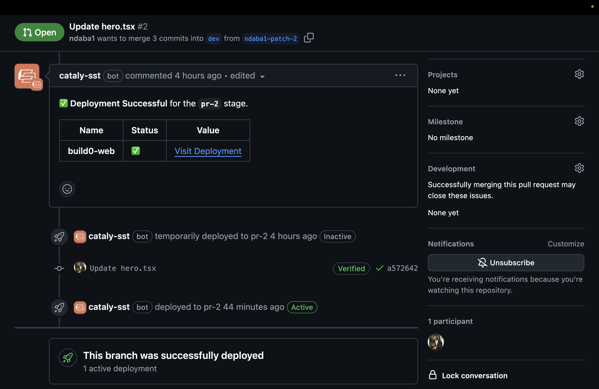

# Catalysst - Supercharge your SST deployments

> A Github App to Catalyse your SST deployments, get it? Catalysst? 😄



## Motivation

After a large migration from Pulumi to SST for a work project, I found the experience with autodeploy to be missing a few things. We were already tightly integrated with Github Actions, but I initially tried to get autodeploy to work for our use case but here's a list of reasons why it didn't work for us:

- `buildspec.yml` customization is not easy and we needed to setup build caching for our Next.js apps. It starts adding up when you have multiple apps and caching could save a lot of time.
- It was essential to have that vercel-like experience, with the links of every PR preview deployment displayed on the PR itself to make it easier for QA/reviewers to test the changes.
- PRs can have labels added to them to trigger different behavior during deployment. Since `autodeploy` function on sst is not async and contains minimal information, it was hard to implement this feature.
- There's no way to use `autodeploy` with Github Actions, which you might need to do, if like us, you find that deployments on codebuild tend to be slower for some reason - I could not find any logical reason for this, but it kept happening. In contrast, using github can run on both native actions runners and self-hosted runners (Codebuild).
- SST Console requires manual intervention to create environments, which is not ideal for PR preview deployments. Our setup worked better with transient environments that are created and deleted automatically.

Eventually, we ended up using Github Actions to deploy our SST apps, but it was a bit of a hassle to setup and maintain. This is where Catalysst comes in.

## Features

- **PR Preview Deployments**: Catalysst will automatically deploy your SST app to a preview URL on every PR. The URL will be displayed on the PR itself.
- **Auto cleanup**: Catalysst will automatically cleanup the preview deployments when the PR is closed or merged.
- **Highly Customizable**: Catalysst is highly customizable. Being open source, you can simply fork the repo and publish your own version of the app with your own customizations.
- **Github Native**: Catalysst is a Github App, so it's tightly integrated with Github. You can use Github Actions to deploy your SST apps with Catalysst.
- **Github Checks**: Catalysst integrates with Github's check API to show status of deployments. You can use this to block PR merges until the deployment is successful.

## Setup

1. Define a config for your repo in `.github/sst-config.yml`:

```yaml
# .github/sst-config.yml

# workspace name on sst console
workspace: build0

# default branch
defaultBranch: dev

# name of the sst workflow file
workflowId: sst.yml

# <branch>: <stage> mappings
branchMappings:
  dev: dev
  main: prod
```

2. Copy over the `sst.yml` workflow file to your repo: (feel free to customize this file)

```yaml
name: sst

on:
  workflow_dispatch:
    inputs:
      action:
        description: "The action to perform"
        required: true
      stage:
        description: "The stage to deploy to"
        required: true

concurrency:
  group: ${{ github.workflow }}-${{ inputs.stage }}

permissions: write-all

jobs:
  sst:
    runs-on: ubuntu-latest

    # if the action is remove, fallback to dev since we'll have
    # deleted the environment and don't want it to be created again
    environment: ${{ github.event.inputs.action == 'deploy' && github.event.inputs.stage || 'dev' }}
    env:
      SST_ACTION: ${{ github.event.inputs.action }}
      SST_STAGE: ${{ github.event.inputs.stage }}
    steps:
      - uses: actions/checkout@v4

      - uses: pnpm/action-setup@v4

      - uses: actions/setup-node@v4
        with:
          node-version: 22
          cache: "pnpm"

      - name: Setup cache for web app
        uses: actions/cache@v4
        with:
          path: ./apps/web/.next/cache
          key: ${{ runner.os }}-nextjs-web-${{ hashFiles('./pnpm-lock.yaml') }}-${{ hashFiles('apps/web/src/**/*.{js,jsx,ts,tsx}') }}
          restore-keys: |
            ${{ runner.os }}-nextjs-web-${{ hashFiles('./pnpm-lock.yaml') }}-

      - name: Install dependencies
        run: pnpm install

      - name: Configure Credentials
        uses: sst-actions/setup-aws@main
        with:
          aws_region: "us-east-2"
          role_arn: ${{ secrets.AWS_ROLE_ARN }}

      - name: Run SST command
        run: |
          npx sst $SST_ACTION --stage $SST_STAGE

      - id: sst_outputs
        name: Export sst outputs
        run: echo "RESOURCES=$(cat .sst/outputs.json)" >> "$GITHUB_OUTPUT"

      - name: Update Deployment Environment
        if: ${{ github.event.inputs.action == 'deploy' }}
        uses: sst-actions/update-env@main
        with:
          repository: ${{ github.repository }}
          # make sure token has `variables` write scope
          token: ${{ secrets.CATALYSST_TOKEN }}
          outputs: ${{ steps.sst_outputs.outputs.RESOURCES }}
          stage: ${{ github.event.inputs.stage }}
```

This workflow will require you to create a token on your Github account with `variables` write scope. You can do this by going to `Settings` -> `Developer Settings` -> `Personal Access Tokens` -> `Generate new token`. Make sure to store this token in your Github secrets as `CATALYSST_TOKEN` (or whatever you want to call it if customized).

When SST is done deploying, this token is used to add a new variable, named `SST_OUTPUTS` to the environment/stage associated with the deployment. This is how the app urls are accessible to the Github App.

You will also need to create an IAM role to grant github permissions to your AWS account. You can learn more about setting this up [here](https://github.com/sst-actions/setup-aws?tab=readme-ov-file#configuring-aws-credentials)

You won't need to change anything else unless you have customized the workflow file.

3. Return urls object from your sst config

```ts
/// <reference path="./.sst/platform/config.d.ts" />

export default $config({
  app(input) {
    return {
      name: "build0",
      removal: input?.stage === "production" ? "retain" : "remove",
      home: "aws",
      providers: {
        aws: {
          region: "us-east-2",
        },
      },
    };
  },
  async run() {
    const infra = await import("./infra");

    return {
      // make sure to return urls
      urls: {
        "build0-web": infra.website.url,
      },
    };
  },
});
```

In your sst config, make sure to return the urls object from the run function. This is how the app urls are accessible to the Github App.

## How it works

1. Environments
   Similar to SST Console's autodeploy, every deployment is associated with an environment. Difference here being the environment is created on the fly and deleted when the PR is closed or merged - and is on Github. Deleting transient environments is important since github can only allow a given number of environments (100) at a time.
   Variables can also be added to said environments and will be accessible to the SST workflow when deploying your app.

2. Deployments
   The bot/github app manually triggers the deployment by sending a `workflow_dispatch` event to the SST workflow. This is done by the bot when a PR is opened or updated. Cool thing about this is github automatically links the deployment to the PR, so you can see the deployment status on the PR itself. But on top of that, the app also adds a check to the PR to show the deployment status. You can make this check required to merge the PR if you want.

3. Cleanup
   When the PR is closed or merged, the bot will delete the environment associated with the PR. This is done by sending a `workflow_dispatch` event to the SST workflow with the `action` set to `remove`. This will delete the environment on github, then proceed to teardown the resources on AWS.

4. Comments
   The bot comments on PRs for the following events:
   - When a PR is being deployed
   - When a PR is successfully deployed
   - When a PR deployment fails
     On successful deployment, the bot will add a comment with links to the deployed app provided you have completed the setup as described above.

## Publishing your own version of Catalysst

If you want to publish your own version of Catalysst, you can fork this repo and make your own customizations. You can then publish your own version of the app to the Github Marketplace (public or private).

The app is built using the Probot framework and the [manifest](./app.yml) already contains all the permissions and events required for this to work as expected. You can customize this file to add more permissions or events as needed.

Assuming you've cloned and installed the dependencies:

```bash
# build the app
pnpm build

# start the app
pnpm start
```

This will start the app on `http://localhost:3000`. By default, a smee proxy is used to receive events from Github when testing locally.
When you open the browser, you will be redirected to the Github app creation flow. You can create a new app and install it on your repo to test it out. You will need to choose a unique name for your app.

But once that's done, you can then use SST to deploy a live version of the app to AWS. You can then update the callback url to that of your deployed API.

```bash
pnpm sst deploy --stage prod
```

## Contributing

If you have suggestions for how catalysst could be improved, or want to report a bug, open an issue! We'd love all and any contributions.

For more, check out the [Contributing Guide](CONTRIBUTING.md).

## License

[ISC](LICENSE) © 2024 Victor Ndaba
